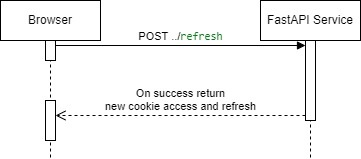

# ConnectKit FastAPIAuthentication [[en](./README.md)|*ru*]

___

ConnectKit FastAPIAuthentication добавляет аккаунты, сессии пользователей и механизм аутентификации
пользователей с применением JWT для приложений на FastAPI.

Вход через oauth2 или openid connect не поддерживается на данный момент.

## Установка

___

```shell
pip install ConnectKit-FastAPIAuthentication
```

## Использование

___

Параметры конфигурации загружаются из переменных окружения, но могут быть в последствии переопределены.

    SECURE_SECRET=str                 # Ключ для подписи JWT
    SECURE_ACCESS_EXPIRE=5            # Время действия access токена в минутах
    SECURE_REFRESH_EXPIRE=24          # Время действия refresh токена в часах для короткой сессии
    SECURE_REFRESH_LONG_EXPIRE=720    # Время действия refresh токена в часах для длинной сессии
    SECURE_PATH=/api                  # Префикс пути, к которому будет привязан cookie с токеном
    SECURE_COOKIE_NAME=access         # Имя cookie, в котором будет токен
    SECURE_ONLY=True                  # Указание браузеру принимать токен, только если https
    SECURE_BLOCK_TRIES=5              # Количество попыток неправильного ввода пароля, до блокировки аккаунта
    SECURE_OTP_ENABLED=True           # Использовать 2FA через одноразовые пароли
    SECURE_OTP_BLOCK_TRIES=3          # Количество попыток передать OTP перед logout
    SECURE_OTP_ISSUER=Localhost inc.  # Идентификатор OTP, передаваемый при включении 2FA
    SECURE_STRICT_VERIFICATION=True   # Строгая верификация для повторного ввода пароля

Для переопределения:

```python
from authentication.settings import settings

settings.SECURE_COOKIE_NAME = "new_name"
```

[Для настройки подключения к БД](https://github.com/mtuciru/ConnectKit-Database/blob/master/README_RU.md).

Для включения эндпоинтов авторизации:

```python
from fastapi import FastAPI
from authentication import router as auth_router

app = FastAPI()
app.include_router(auth_router, prefix="/api/auth")

```

Для получения аккаунта или текущей сессии:

```python
from fastapi import APIRouter, Depends
from authentication import get_account, get_session
from authentication.models import Account, AccountSession
from authentication.errors import auth_errors, with_errors

router = APIRouter()


@router.get("/test", responses=with_errors(*auth_errors))
async def test(account: Account = Depends(get_account)):
    print(account)


@router.get("/test2", responses=with_errors(*auth_errors))
async def test2(account_session: AccountSession = Depends(get_session)):
    print(account_session)

```

Функция `get_session` проверяет наличие сессии и прохождение 2FA.

Функция `get_account` проверяет то же, что и `get_session`, а также статус активации аккаунта.

В случае, если вход не выполнен, либо устарел, будет выброшена HTTPException из списка ошибок `auth_errors`.

Для реализации формы регистрации, ручного добавления пользователей и административной работы:

```python
from authentication import (NewAccount, login_rules, password_rules,
                            login_type, password_type,
                            create_new_account, delete_account,
                            block_account, unblock_account, get_block_status,
                            get_status_otp, disable_otp)
from pydantic import BaseModel, EmailStr

# Создание нового пользователя

try:
    new_acc = NewAccount(
        login="root",  # Логин пользователя, уникальный, задаётся правилом login_rules
        password="password",  # Пароль пользователя, задаётся правилом password_rules
        properties={  # Свойства пользователя, требуемые в конкретной задаче, Dict[str, Any]
            "name": "name"
        },
        active=True  # Активирован ли аккаунт, по умолчанию False
    )
    account = await create_new_account(new_acc)
except ValueError as e:
    # Пользователь уже существует, либо ошибка валидации NewAccount
    pass


# Пример схемы регистрации

class UserRegistration(BaseModel):
    login: login_type
    nickname: str
    email: EmailStr
    password: password_type


# Удаление аккаунта
await delete_account(account)

# Получение статуса блокировки (bool, Optional[str])
block, reason = await get_block_status(account)

# Получение статуса 2FA 
otp_enabled = await get_status_otp(account)

# Блокировка аккаунта (заблокированный аккаунт не может выполнить login)
await block_account(account, "reason")

# Разблокировка аккаунта
await unblock_account(account)

# Принудительное отключение otp
await disable_otp(account)


```

Диаграмма аутентификации:


Диаграмма обновления токенов:


## Лицензия

___

ConnectKit FastAPIAuthentication распространяется под [лицензией MIT](./LICENSE).